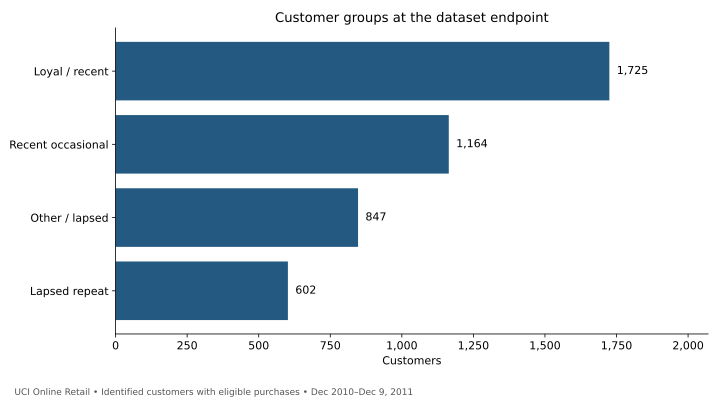
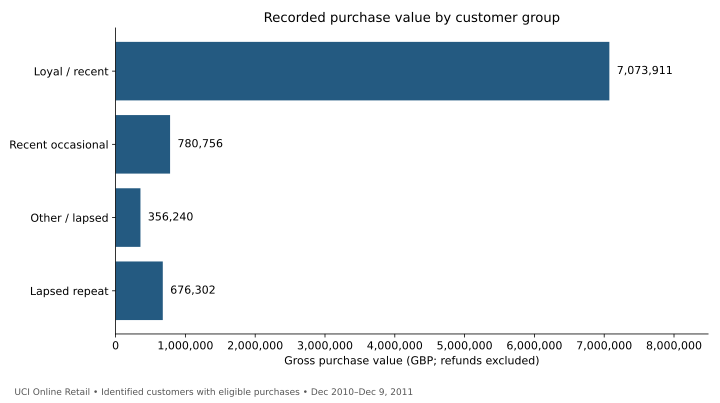
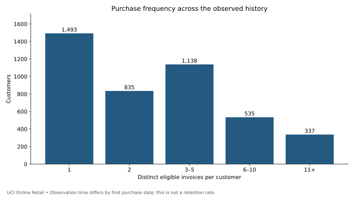
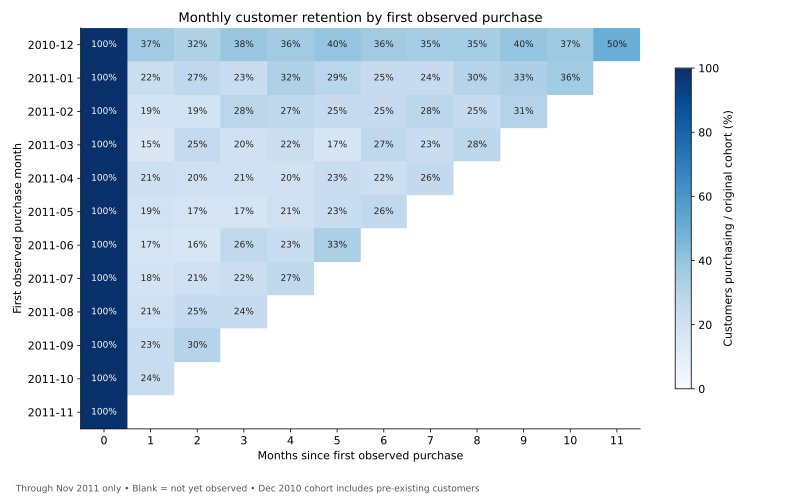

# Customer Purchasing, Segmentation & Retention

A completed Python portfolio case study using **541,909 real retail transaction rows** to identify customer groups, measure repeat purchasing, and compare retention at equal cohort ages.

**Main finding:** 1,725 loyal/recent customers (39.76% of eligible customers) account for 79.60% of recorded eligible gross purchase value. A separate 602-customer lapsed-repeat group is a candidate for a measured win-back experiment.

## Business decision
How should a retailer prioritize customer outreach while distinguishing past spending, repeat purchasing, and retention?

## Results at a glance

| Metric | Result | Scope |
|---|---:|---|
| Eligible purchase rows | 392,692 | After documented sequential exclusions |
| Identified customers | 4,338 | At least one eligible purchase |
| Distinct invoices | 18,532 | Positive, noncancellation purchases |
| Gross purchase value | £8,887,208.89 | Refunds excluded; not net revenue |
| Repeat purchasers | 2,845 (65.58%) | At least two invoices in observed history |
| Month-one cohort retention | 19.94% | 616 / 3,089 customers; Jan–Oct 2011 cohorts |

### Customer groups


Segments use recency and frequency with a reference date of December 10, 2011. Monetary value is measured separately. Recent means a purchase within 90 days; loyal/recent also requires at least three distinct invoices. These are transparent operational rules, not a trained predictive model.

### Spending concentration


The loyal/recent group accounts for £7.07m in gross purchase value. The highest-spending 44 customers (approximately the top 1%) account for 32.06% of eligible value. High past spending is not the same as future lifetime value or campaign responsiveness.

### Repeat purchasing


1,493 customers have one eligible invoice. The 65.58% repeat-purchase share uses all observed history and unequal customer observation windows; it is distinct from the cohort retention metric below.

### Retention at comparable ages


Across first-observed purchase cohorts January–October 2011, 616 of 3,089 customers purchased in the following calendar month (19.94%). December 2010 is excluded from this pooled comparison because it includes customers whose actual first purchase may predate the dataset. December 2011 is excluded from the heatmap because the source ends on December 9. Blank cells are unobserved, not zero retention.

## Recommendation
Prioritize reliable service for the loyal/recent group and test a modest win-back campaign for the 602 lapsed-repeat customers. Their observed gross spend is £676,302.49; that amount is historical spending, not recoverable revenue. Randomize outreach and compare incremental purchases and margin after campaign cost before scaling.

## Explore the work
- [Executed analysis notebook](analysis.ipynb)
- [Detailed findings and proposed experiment](docs/findings.md)
- [Methods and data quality](docs/methodology.md)
- [Interview walkthrough](docs/interview-guide.md)
- [Aggregate result tables](results/)
- [Validation record](docs/validation.md)
- [SQL e-commerce case study](https://github.com/raeparrishprogit/sql-ecommerce-analysis)

## Reproduce
Python 3.12 was used. From the repository folder:

```sh
python -m pip install -r requirements.txt
python download_data.py
python build_portfolio.py
```

This downloads the original workbook, cleans it, computes RFM summaries and cohorts, checks reconciliations, and regenerates aggregate tables and charts. Open `analysis.ipynb` in Jupyter or VS Code and run all cells to rebuild its saved outputs. Customer-level output remains local and is ignored by Git.

## Source and attribution
Chen, D. (2015). [Online Retail, UCI Machine Learning Repository](https://archive.ics.uci.edu/dataset/352/online+retail). [DOI: 10.24432/C5BW33](https://doi.org/10.24432/C5BW33). Licensed [CC BY 4.0](https://creativecommons.org/licenses/by/4.0/). Downloaded October 1, 2026. Source transactions span December 1, 2010–December 9, 2011; figures describe that historical extract.

Prepared with AI assistance; calculations were executed and checked against the full source workbook. This is an independent portfolio case study, not evidence of a deployed campaign or realized business impact.
